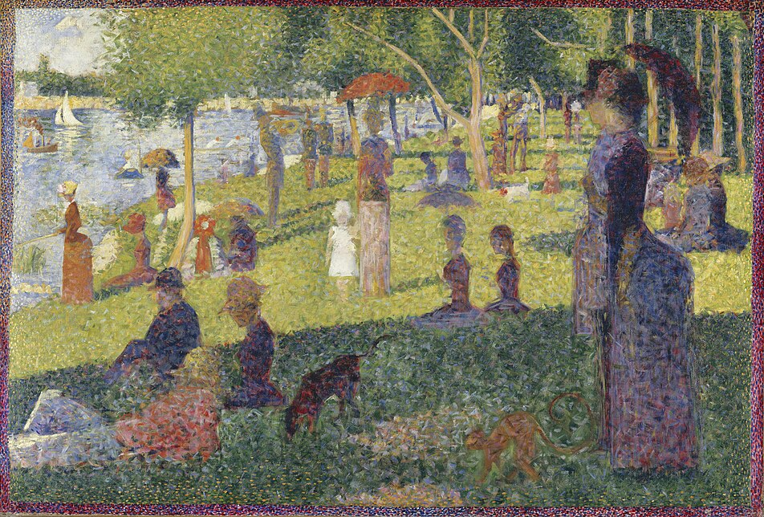

<figure>
  
  <figcaption>
    Hazy faces in <i>Study for A Sunday Afternoon on La Grande Jatte</i>.
    Seurat, 1886.
  </figcaption>
</figure>

Every scenario under the sun, it seems, has a [zero-knowledge proof](https://www.wikiwand.com/en/articles/Zero-knowledge_proof) waiting to be found.

Earlier this year, Google [open-sourced](https://github.com/google/longfellow-zk) its ZKP library. In the announcement, they describe a sample application:

> So, for example, a person visiting a website can verifiably prove he or she is over 18, without sharing anything else at all.[^1]

Zero-knowledge proofs might segregate AI slop:

> Moreover, the use of [ZKP] is accelerating due to the urgency with which identity credentials are needed ... to discern humans – and human-generated content – from machines and AI-generated content.[^2]

and avert data breaches:

> Imagine being able to login to websites without worrying about your password getting hacked[^3]

However, zero knowledge feels like overkill for these problems, and I think we don't talk about alternatives enough.

# Defining zero knowledge

[Enough](https://www.reddit.com/r/crypto/comments/stspyl/is_digital_signature_a_form_of_zero_knowledge/) [people](https://crypto.stackexchange.com/questions/100454/did-digital-signatures-come-from-zero-knowledge-proofs) conflate digital signatures with some form of zero-knowledge that I should clarify.

Broadly, when folks discuss zero-knowledge schemes, they usually mean either the [SNARK](https://vitalik.eth.limo/general/2022/06/15/using_snarks.html) family or the [STARK](https://aszepieniec.github.io/stark-anatomy/) one.

Both families utilize complex computational circuits designed to verify arbitrary computations, without revealing what _was_ computed.

They are fashionable among blockchains, where the trust setting is perfectly tailored for their needs:

- Mutual distrust
- Sensitive information
- High transparency

Because ZKPs guarantee revealing nothing besides a predicate's result, they work as a useful primitive for many cryptographic tasks.

Frankly, they're fine. Where the stakes are high, they have an excellent niche.

## So what's the problem?

People incorrectly assume zero trust is required.

Consider the same introductory usecases, except this time with a trusted party vouching for you:

1. A government certifies your adulthood
2. A CAPTCHA service attests your humanity
3. An identity provider logs in on your behalf

Much simpler, right? You might have even done some of this today!

Here, invoking the machinery of SNARK / STARK creates needless friction. These are cases where the data is not _confidential_, but is still _sensitive_ -- the risk is reputational, rather than personal. 

As such, the technical complexity of a computational circuit -- which works well for confidential data -- is unwarranted.

## ZKPs _appear_ advantaged in this problem space

The main reason ZKPs attract attention is the compelling privacy guarantee: by minimizing the amount of information shared, they prevent *any* kind of fingerprinting.

Fingerprinting protection is necessary, even in a trusting world. The best data stewards may become compromised or corrupted -- the worst might be incompetent. A data breach in this scenario doesn't just leak your data -- it enables tracking and surveillance. 

Paradoxically, vigilance appears necessary where trust is abundant.

Zero-knowledge proofs embrace a hyper-vigilant world, a feature buttressed by the distressing lack of alternatives. For the longest time, the choice was to either:

1. trust attesters completely (and open yourself to risk)
2. not to trust anyone at all (embrace the zero-trust way).

But this dichotomy is illusory. There is a _third_ path, where you supply just enough coarseness to your interactions to mitigate fingerprinting.

Let me discuss this idea in the context of a reference protocol I've been learning about.

# The Privacy Pass model

<details>
  <summary>Disclaimer</summary>
  
  I work on the team that maintains Cloudflare's Privacy Pass implementation. 
  
  But all opinions are my own.
</details>

This weekend, I crammed [three](https://www.rfc-editor.org/rfc/rfc9576.html) [IETF](https://www.rfc-editor.org/rfc/rfc9577.html) [RFCs](https://www.rfc-editor.org/rfc/rfc9578.html) in one go. Clocking in at seventy-five pages, it wasn't exactly light reading.

Taken together, they describe the Privacy Pass protocol, which is a system comprising three logical roles (besides you, the client):

1. Attesters vouch for you, without knowing what you'll do with those vouchers.
2. Issuers accept attestations and dispatch tokens, without being able to link you.
3. Origins redeem your tokens, granting you access to the content they protect.

These tokens are transferable. They can be accumulated. They can be spent. There is exceedingly low risk of being tied back to you.

In this, they are unlike cookies, the sticky neon signs that most services use today. That is already an example of "adding coarseness" -- all services receive is the token, indistinguishable from the rest.

Here is a complete `Token`, in fact, lifted from the [RFC](https://www.rfc-editor.org/rfc/rfc9577.html#section-2.1.1-5).

```c
struct {
    uint16_t token_type; // 0x1 or 0x2
    uint8_t nonce[32];
    uint8_t challenge_digest[32];
    uint8_t token_key_id[Nid];
    uint8_t authenticator[Nk];
} Token;
```

These fields each represent the bare minimum for verification. I'm only going to talk about type 2 tokens, which are represented as `0x2` in the `token_type` field. These are publicly verifiable, which means anyone can verify a token. 

Here, `nonce` is a _client-generated_ random 32-byte array. That means you or your device creates it.

`challenge_digest` is a SHA-256 hash of a [`TokenChallenge`](https://www.rfc-editor.org/rfc/rfc9577.html#section-2.1.1-5):

```c
struct {
    uint16_t token_type;
    opaque issuer_name<1..2^16-1>;
    opaque redemption_context<0..32>;
    opaque origin_info<0..2^16-1>;
} TokenChallenge;
```

`TokenChallenges` are issued by origins to clients when they require a token to proceed further:

- The `issuer_name` tells the client where to go to fetch tokens. This is the location of the issuer.
- The `redemption_context` optionally links your session to the service, encoded as a 32-byte value.
- The `origin_info` is the set of domains the token can be spent on, and works to scope your access to just that service.

<details>
  <summary>Isn't `redemption_context` a fingerprint?</summary>
  
  Yes, but it's quite weak. 

  Privacy Pass tokens are transferable. This means that tokens issued for one session might be transferred to another user, who has no connection to the original session.

  Formally, the protocol ensures *origin-client unlinkability*: given two different redemption contexts, it isn't possible to tell if they came from the same client. 
  
  At best, a `redemption context` can only function as a session identifier, rather than a persistent cookie.
</details>

When a client receives a `TokenChallenge`, it consults the `issuer_name`, and fetches the [issuer directory](https://www.rfc-editor.org/rfc/rfc9578.html#section-4-3). This is a JSON page containing public keys for the issuer, and an endpoint that accepts a [`TokenRequest`](https://www.rfc-editor.org/rfc/rfc9578.html#section-6.1-5) (usually hit by an attester on behalf of the client): 

```c
struct {
  uint16_t token_type = 0x2;
  uint8_t truncated_token_key_id;
  uint8_t blinded_msg[Nk];
} TokenRequest;
```

A `token_key_id` refers to a specific public key advertised by the issuer. You may recognize it from the `Token` struct above -- its entry in the `TokenRequest` informs the issuer which key to use.

Here's where Privacy Pass becomes cryptographically interesting. The `blinded_msg` is a reference to a [blind signing scheme](https://www.wikiwand.com/en/articles/Blind_signature), where the client disguises a message, has that disguised -- or blinded -- message signed, then unblinds the message and derives the "true" signature. In this case, we are using the classic blind RSA algorithm.

What that means is that the issuer, when it sees this request, *has no idea* who the token is going to, nor what the token is going to be used for, nor even what token looks like. Thus, **origins and issuers cannot track tokens**, even if origin and issuer are owned by the same entity.

The issuer now returns a simple `blinded_sig` signature, which the client unfurls into a different value called the `authenticator`. Armed with these values, the client now produces a `Token`.

To verify a token, an origin must run the blind RSA verification step, which utilizes the `authenticator` as a signature. If the verification passes, the origin knows the client is attested!

## The attester learns nothing of your intent

All the state of the blinded message -- the nonce and challenge digest we saw earlier in the final `Token` -- is local to the _client_.

The attester's sole job is to prove to the issuer that the `TokenRequest` was legitimately issued -- either with a digital signature attached to the request, or having attesters forward the `TokenRequest` as a trusted adviser. 

Further, the attester cannot link you to the origin. Because it has no access to the challenge, it cannot pinpoint which origin you were trying to visit. 

Your verification data stays secure in the exchange between you and attester.

# Analysis

Of course, Privacy Pass' biggest weakness is ironically also its strength: tokens are transferable. This means that you cannot quite settle legal compliance with straightforward application -- adults might obtain vouchers for adult content and sell them to minors, with no way for the service to know. 

Beyond that, it has other weaknesses:

1. It requires an ecosystem of attesters and issuers for broad adoption.
2. Privacy Pass struggles with rate-limiting. An issuer can return multiple tokens in a single challenge, which translate into lots of verified access, and solving this is hard[^6]. 

Despite that, it is still useful to examine as a _basis_ for more advanced schemes. Mainly, it features extensiblity:

1. The setup allows the same entity to control some or all three roles -- attester, origin and issuer -- without violating its privacy guarantees[^5]. 
2. It pairs well with a client VPN to protect client identity even further, leveraging existing widely available technology.
3. A challenge can be narrowly scoped or be interchangeable across origins.
4. It imposes no restrictions on how a client must engage with an attester, leaving arbitrary options open.
5. Performance-wise, Privacy Pass utilizes a network of parties rather than raw compute, making the exchange cheaper at the possible risk of tail latency.

Privacy Pass works really well as an access system where the consequences of misattribution are low and the number of tokens issued per attestation is low. I believe they prove the thesis that attestation does not require fingerprinting by credentials, and I'm excited to see how they might develop for legal compliance cases where transferability is not an option.

[^1]: [Opening up ‘Zero-Knowledge Proof’ technology to promote privacy in age assurance](https://blog.google/technology/safety-security/opening-up-zero-knowledge-proof-technology-to-promote-privacy-in-age-assurance/)
[^2]: [The State of Zero-Knowledge Proofs: From Research to Serious Business](https://www.protocol.ai/blog/zero-knowledge-proofs/)
[^3]: [Zero-Knowledge Proofs: A Beginner's Guide](https://www.dock.io/post/zero-knowledge-proofs)
[^5]: Okay, I shouldn't be so hasty. These setups still require some architectural guidance to avoid accidentally reducing a client's anonymity -- for example, an entity could compare the time of any attester access and any challenge issuance to narrow down client behaviour. But the point is that clients have certain defenses in this regard, such as spacing out their access time.
[^6]: But [actively](https://datatracker.ietf.org/doc/html/draft-ietf-privacypass-rate-limit-tokens-06) being worked on.